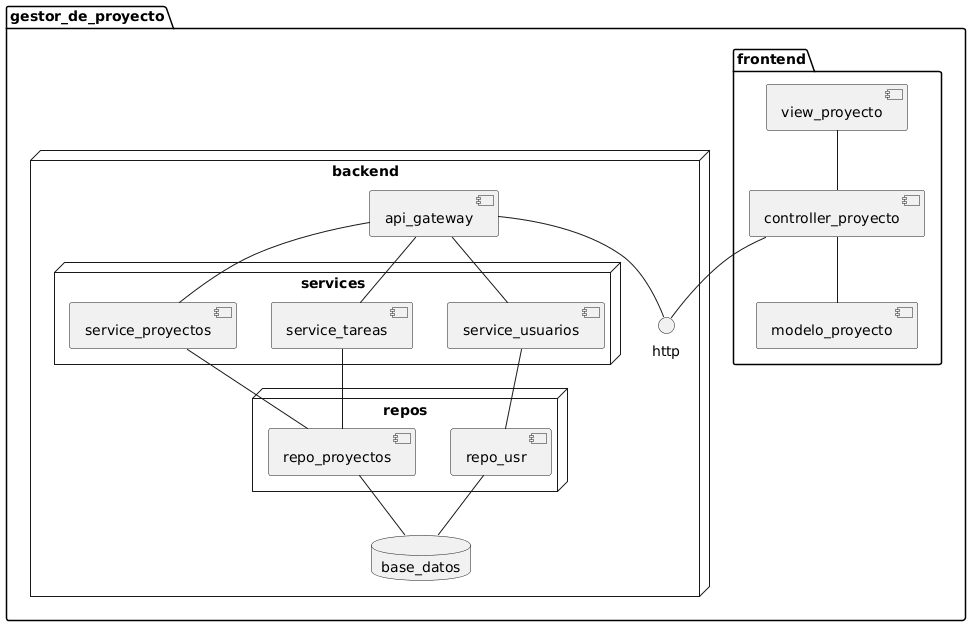

@startuml

skinparam componentStyle rectangle
skinparam backgroundColor white
skinparam shadowing false

title Diagrama de Componentes - Gestor de Proyectos

package "Frontend (Svelte)" {
    component "View" as view
    component "Controller" as controller
    component "Model" as model
    
    view -up-> controller
    controller -up-> model
}

package "Backend (FastAPI)" {
    component "API Gateway" as api
    
    package "Services" {
        component "User Service" as s_user
        component "Project Service" as s_project
        component "Task Service" as s_task
    }
    
    package "Repositories" {
        component "User Repository" as r_user
        component "Project Repository" as r_project
        component "Task Repository" as r_task
    }
    
    api --> s_user
    api --> s_project
    api --> s_task
    
    s_user --> r_user
    s_project --> r_project
    s_task --> r_task
}

database "PostgreSQL" as db

' Interfaces
interface "REST API" as rest
interface "SQL" as sql

' Connections
model -right-> rest
rest -right-> api
r_user -down-> sql
r_project -down-> sql
r_task -down-> sql
sql -down-> db

@enduml

