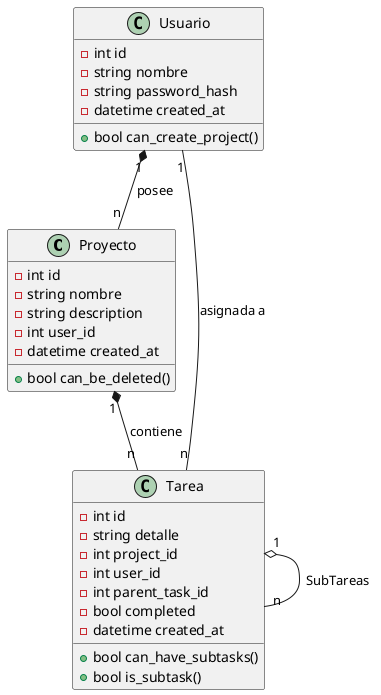

```plantuml
@startuml
class Proyecto {
    - int id
    - string nombre
    - string description
    - int user_id
    - datetime created_at
    + bool can_be_deleted()
}

class Tarea {
    - int id
    - string detalle
    - int project_id
    - int user_id
    - int parent_task_id
    - bool completed
    - datetime created_at
    + bool can_have_subtasks()
    + bool is_subtask()
}

class Usuario {
    - int id
    - string nombre
    - string password_hash
    - datetime created_at
    + bool can_create_project()
}

Proyecto "1" *-- "n" Tarea : contiene
Tarea "1" o-- "n" Tarea : SubTareas
Usuario "1" *-- "n" Proyecto : posee
Usuario "1" -- "n" Tarea : asignada a
@enduml
```
