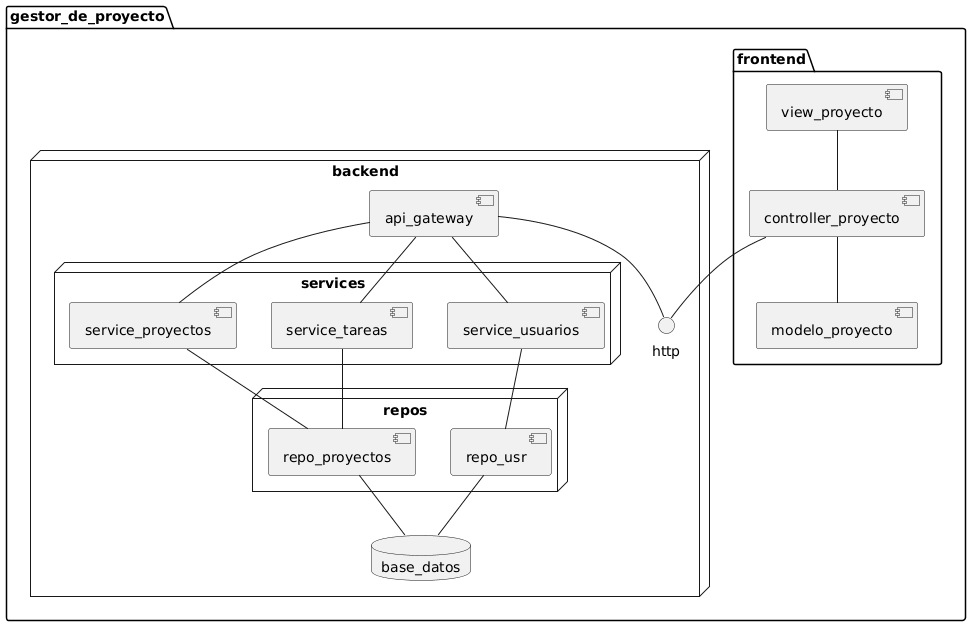

@startuml

package gestor_de_proyecto {
    node backend {
        [api_gateway] -- http

        node "repos"  {
            [repo_usr] as r_usr
            [repo_proyectos] as r_task 
        } 

        node services {
            [service_proyectos] -- r_task
            [service_tareas] -- r_task
            [service_usuarios] -- r_usr
        } 

        database "base_datos" as db
    }

package frontend {
    [view_proyecto] as vp
    [controller_proyecto] as cp
    [modelo_proyecto] as mp
}
 
cp -- mp
vp -- cp 
cp -- http

db -up- r_usr
db -up- r_task

api_gateway -- service_proyectos
api_gateway -- service_tareas
api_gateway -- service_usuarios

}
@enduml

